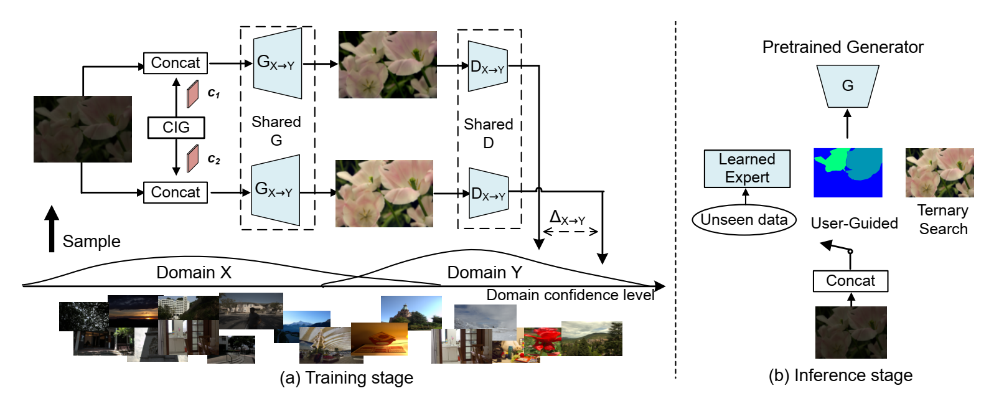
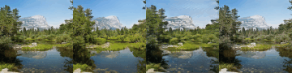
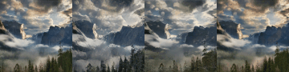
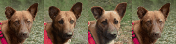
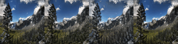
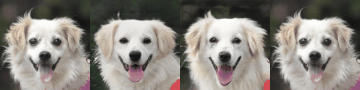
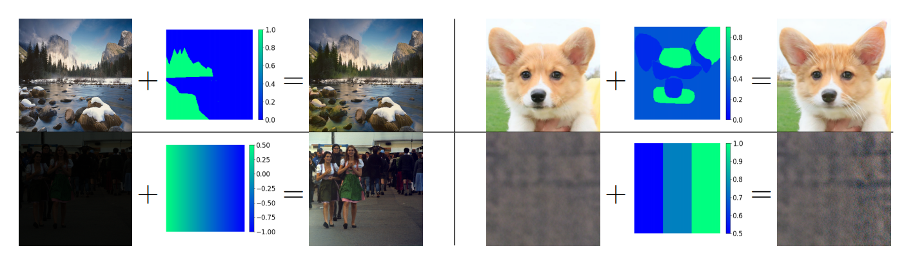

# MonoPix - Contrastive Monotonic Pixel-Level Modulation

[ECCV' 2022 Oral].

**Abstract**


> Continuous one-to-many mapping is a less investigated yet important task in both low-level visions and neural image translation. In this paper, we present a new formulation called MonoPix, an unsupervised and contrastive continuous modulation model, and take a step further to enable a pixel-level spatial control which is critical but can not be properly handled previously. The key feature of this work is to model the monotonicity between controlling signals and the domain discriminator with a novel contrastive modulation framework and corresponding monotonicity constraints. We have also introduced a selective inference strategy with logarithmic approximation complexity and support fast domain adaptations. The state-of-the-art performance is validated on a variety of continuous mapping tasks, including AFHQ cat-dog and Yosemite summer-winter translation. The introduced approach also helps to provide a new solution for many low-level tasks like low-light enhancement and natural noise generation, which is beyond the long-established practice of one-to-one training and inference.




A few representative images. Results produced by MonoPix are shown in the last row.

|Summer-Winter|Cat-Dog|
|:---:|:---:|
|S2W: |C2D: |
|S2W: |C2D: |
|W2S: |D2C: |
|W2S: |D2C: |


**This repository is still under construction. arXiv version will be updated soon.**

### Requirements

```
pip install -r requirements.txt
```

### Dataset Preparation

Download Yosemite (from [CycleGAN](https://github.com/junyanz/pytorch-CycleGAN-and-pix2pix)), AFHQ (from [StarGANv2](https://github.com/clovaai/stargan-v2)) and [LOL](https://daooshee.github.io/BMVC2018website/) (along with [EnlightenGAN](https://github.com/VITA-Group/EnlightenGAN)) dataset, then split the training images into two domains.


```
.
├── DATA_ROOT
│   └── trainA_Domain
│           ├── IMAGE 1
│           └── IMAGE 2 ...
│   └── trainB_Domain
│           ├── IMAGE 1
│           └── ...
```

In our experiments, we have the following folders: `trainA_Winter`, `trainB_Summer` (we use Winter as domain A, this is not a must), `trainA_Cat`, `trainB_Dog`, `trainA_LOL` (low-light images from LOL) and `trainB_LOL` (normal light images from EnlightenGAN, not normal images from LOL dataset). You may also need to download pretrained VGG weights following instructions in [EnlightenGAN](https://github.com/VITA-Group/EnlightenGAN). 

For SIDD noise generation task, we follow [DANet's](https://github.com/zsyOAOA/DANet) steps to prepare the dataset (into `.hdf5` files). SIDD images are not required to be placed in `$DATA_ROOT`; instead it is specified by the option `--h5file_path`.


### Training

You need to specify the dataset (maybe also VGG model) directory before running the following codes.

```
python train.py --config configs/MonoPix_SummerWinter_Default.yaml
python train.py --config configs/MonoPix_CatDog_Default.yaml
python train.py --config configs/MonoPix_LowLight_Default.yaml
python train.py --config configs/MonoPix_Noise_Default.yaml
```

In Summer-Winter (Yosemite) and Cat-Dog (AFHQ) tasks, we implement a bi-directional translation, while for Lowlight (LOL) and Noise (SIDD), we only train one generator and one discriminator for uni-directional modulation. MonoPix is now implemented with CycleGAN framework, and performs better on style modulations, but is not typically designed for shape translation (which may get improved when integrated with a StarGAN framework).

Though we add color loss in SIDD dataset, the generated results still bear certain color shift. We perform an early stop on this task. Actually you can observe the continuous modulation process in `visualize` folder after a few training epochs.


### PreTrained Models


|Google Drive | Baidu Netdisk|
|:----:|:----:|
|[Link](https://drive.google.com/drive/folders/1Q2R7acNNsr8wrMN3ooecOpWxKRE8ym2i?usp=sharing)|[Link](https://pan.baidu.com/s/1-S73BFEsNMoMb4H3uH5Neg) extraction code: `om49`|


The above checkpoints are placed into `./checkpoints`.

Note that for better readability, we integrated the training codes for all four tasks. As a result, all the normalization layers occurred in the pretrained models (i.e., `BN`, `IN`, and `Identity`) are named as `norm` in the integrated code. You do not need to manually deal with this, as we have already renamed all norm layers when loading the pretrained checkpoints. (see `BaseModel.load_network`)


### Inference

#### Generating the whole translation trajectory

```
# Yosemite and AFHQ:
python predict.py --config configs/MonoPix_$TASK_Default.yaml \
				  --input_path $PATH_INPUT --lower 0 --higher 1 \
				  --inf_type exhaustive --which_epoch $EPOCH \
				  --N_search 10 --which_direction [AtoB or BtoA] \
				  --tag [recommend as S2W/W2S/C2D/D2C]
				  
# Lowlight:
python predict.py --config configs/MonoPix_LowLight_Default.yaml \
				  --input_path $PATH_INPUT --lower -1 --higher 2 \
				  --inf_type exhaustive --which_epoch $EPOCH --N_search 10
				  
# Noise
python predict.py --config configs/MonoPix_Noise_Default.yaml \
				  --input_path $PATH_INPUT --lower 0 --higher 1.5 
				  --inf_type exhaustive --which_epoch $EPOCH --N_search 10
```

Here we set `N_search` as 10 for demonstration purpose. The generated images are stored in `results`; you can change the path by specifying `--save_path`.


#### Ternary search when reference images are available

For ease of processing, each test image, along with its ground truth reference in SIDD (originally stored in `.mat`) is named like `xx.png`, and stored in different directories.

```
# Yosemite and AFHQ do not have reference images.
# Lowlight:
python predict.py --config configs/MonoPix_LowLight_Default.yaml \
				  --input_path $PATH_INPUT --gt_path $PATH_GT \
				  --lower -1 --higher 2 --inf_type ternary_search \
				  --which_epoch $EPOCH --N_search 7

# Noise:
python predict.py --config configs/MonoPix_Noise_Default.yaml \
				  --input_path $PATH_INPUT --gt_path $PATH_GT \
				  --lower 0 --higher 1.5 --inf_type ternary_search \
				  --which_epoch $EPOCH --N_search 7
```

### Spatial control examples

We provide a few examples of spatial control, where one can customize the pixel-level translation intensities. The following codes reproduce the results reported in the main paper and supplementary material.

```
python -m Spatical_Control_Example.Demo_Season_SpatialControl
python -m Spatical_Control_Example.Demo_Animal_SpatialControl
python -m Spatical_Control_Example.Demo_Illumination_SpatialControl
python -m Spatical_Control_Example.Demo_Noise_SpatialControl
python -m Spatical_Control_Example.Deom_InsNorm_Activation
```

The pixel-level intensity masks are produced with [GIMP](https://www.gimp.org/), an open-source image editing tool. You can produce your own mask with different tools. 




### Evaluation

#### Continuity

First you need to generate the whole translation trajectory as described above. 

The generated folder has the following structure:
```
./results
├── EXP_NAME
│   └── IMAGE_NAME1
│           ├── IMAGE_NAME1_enhlvl_00.png
│           ├── IMAGE_NAME1_enhlvl_01.png
│           ├── IMAGE_NAME1_enhlvl_xx.png
│           ├── IMAGE_NAME1_enhlvl_10.png
│           └── IMAGE_NAME1_enhlvl_99.png  ("99" denotes the original input image)
│   └── IMAGE_NAME2
│           ├── IMAGE_NAME2_enhlvl_00.png
│           ├── ...
```

Then a `json` file containing `Relative Linearity`, `Absolute Linearity`, `Smoothness` and `Range` can be generated (in $EXP_PATH) with the following codes:

```
# $PATH_INPUT is the folder name.
python Evaluations/Cal_LPIPS_Tragectory.py --path $EXP_PATH
python Evaluations/Eval_Continuity.py --path $EXP_PATH
```


#### FIDs

```
python Evaluations/test_network_FID.py \
		--input_path $EXP_PATH \
		--gt_path $DATA_ROOT \
		--cal_DomainA [0 or 1] \
		--start_lvl [10 for the last image, 0 for the whole trajectory]
```


#### ACC

```
python Evaluations/test_network_ACC.py \
		--input_path $EXP_PATH --cal_DomainA [0 or 1] \
		--ckpt_loadpath $ACC_CKPTS
```

The weights of our trained ResNet50 backbones for calculating ACC can be downloaded at [Google Drive](https://drive.google.com/drive/folders/1_iZCPa8_D09Y2ZvX3FTaV_gVi6yxSOvS?usp=sharing) or [Baidu Netdisk](https://pan.baidu.com/s/1s5ZfPwKVJZdb2FnsLPx_wQ) (extraction code: `1kvf`). These checkpoints are provided to reporduce the results only. 


### Drawbacks:
+ MonoPix currently does not support multi-modal and multi-attribute pixel-level translation.
+ (Maybe not a big problem) Unnatural patterns are produced at high translation intensities.


### Acknowledgments

Our codes are built on the following repositories: 

[CycleGAN](https://github.com/junyanz/pytorch-CycleGAN-and-pix2pix)

[EnlightenGAN](https://github.com/VITA-Group/EnlightenGAN)

[DANet](https://github.com/zsyOAOA/DANet)


### Citation 

```
@inproceedings{lu2022contrastive,
  title={Contrastive monotonic pixel-level modulation},
  author={Lu, Kun and Li, Rongpeng and Zhang, Honggang},
  booktitle={ECCV},
  year={2022}
}

```
